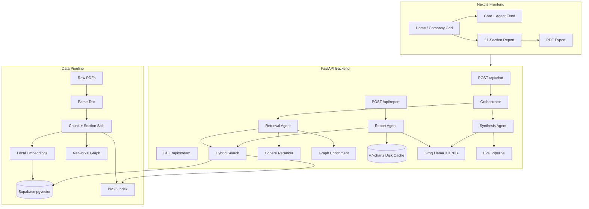

# RupeeRead

Indian Market Analyst project with agentic RAG, citations, SSE reasoning stream, report generation, follow-up memory, and PDF export.

**RupeeRead** covers the **Nifty 20** universe — users can ask filing-grounded financial questions or generate a full **11-section cited equity report** per company, with charts, evaluation scores, follow-up chat, and PDF export.

## Stack

- LLM: Groq (Llama 3.3 70B)
- Embeddings: `sentence-transformers/all-MiniLM-L6-v2`
- Vector DB: Supabase pgvector
- Keyword retrieval: BM25
- Reranker: Cohere with cache table
- Graph layer: NetworkX + `backend/graph.json`
- Backend: FastAPI
- Frontend: Next.js + Tailwind + Framer Motion + Recharts

## Project Structure

- `backend/` — FastAPI app, RAG, agents, evaluation, report cache
- `frontend/` — Next.js UI, report/chat flows, chart parsers, PDF export
- `scripts/` — ingestion pipeline and report warming utilities
- `data/` — local PDFs, parsed text, chunks, embeddings artifacts

---

## Architecture

### System overview



### User flows

| Route | Purpose |
|-------|---------|
| `/` | Nifty 20 company grid, search, pick Chat or Report |
| `/chat?ticker=INFY` | Financial Q&A with live agent-thinking stream, citations, eval scores |
| `/report/[ticker]` | 11-section report, charts, follow-up chat, PDF export |

### Data ingestion pipeline

Offline scripts turn BSE/NSE filings into searchable knowledge:

| Step | Script | Output |
|------|--------|--------|
| 01 | `scripts/01_download_pdfs.py` | `data/raw/` |
| 02 | `scripts/02_parse_pdfs.py` | `data/parsed/` |
| 03 | `scripts/03_chunk_documents.py` | `data/chunks/chunks.jsonl` |
| 04 | `scripts/04_embed_chunks.py` | Local MiniLM embeddings |
| 05 | `scripts/05_store_supabase.py` | Supabase `chunks` table |
| 06 | `scripts/06_build_bm25_index.py` | BM25 keyword index |
| 07 | `scripts/07_build_graph.py` | `backend/graph.json` |

Chunking splits on section markers (MD&A, risk factors, financial statements), uses ~512-token windows with 50-token overlap, and stores 384-dim embeddings in Supabase via `backend/supabase_schema.sql`.

### RAG retrieval (`backend/rag/`)

```
User query
  → Hybrid search (pgvector + BM25, Reciprocal Rank Fusion)
  → Self-correction judge (LLM relevance scoring)
  → Cohere reranker (top 5, cached in Supabase)
  → Graph enrichment (neighbor chunks from NetworkX)
  → Multi-hop retrieval (complex queries only)
```

| Module | Role |
|--------|------|
| `hybrid_search.py` | Fuses vector + BM25 results |
| `vector_search.py` | Supabase `match_chunks` with ticker filter |
| `bm25_search.py` | Local keyword index |
| `reranker.py` | Cohere rerank with cache |
| `self_correction.py` | Adversarial LLM chunk judge |
| `graph_rag.py` | Expands context via chunk graph |
| `multi_hop.py` | Multi-step retrieval for complex questions |
| `hyde.py` | Hypothetical document generation for retrieval |
| `embedder.py` | Local sentence-transformer embeddings |

### Agent layer (`backend/agents/`)

**Chat orchestrator** (`orchestrator.py`):

1. Classifies query (generic vs specific, report-meta vs filing-grounded)
2. Splits history into report context vs chat messages
3. Retrieves context (or skips for report-meta queries)
4. Synthesizes answer (`synthesis_agent.py`)
5. Runs evaluation pipeline

**Report agent** (`report_agent.py`) generates 11 sections per ticker:

1. Executive Summary + Investment Thesis
2. Business Overview + Segment Breakdown
3. Financial Performance
4. Balance Sheet Health + Cash Flow
5. Key Financial Ratios
6. Valuation Snapshot vs Sector Median
7. Management Commentary
8. Key Risks
9. Recent Developments
10. Bull vs Bear vs Base Case
11. Peer Comparison

Each section uses targeted hybrid retrieval + Groq synthesis. Sections 2 and 3 also produce validated `chart_data` (donut segment breakdown, FY24/FY25 bar charts). Reports are cached on disk at `backend/data/report_cache/v7-charts/{TICKER}.json` for all 20 tickers.

### Backend APIs

| Endpoint | Purpose |
|----------|---------|
| `GET /health` | Health check |
| `GET /api/companies` | Nifty 20 company list |
| `POST /api/chat` | Q&A with citations and eval scores |
| `POST /api/report` | 11-section report (cached or live regen) |
| `GET /api/stream` | SSE agent-thinking steps for chat UI |
| `POST /api/summarize` | Section prose → bullet summary |

### Evaluation (`backend/evaluation/`)

Every chat and report answer is scored for faithfulness, hallucination flags, citation accuracy, answer relevance, and an overall grade (A/B). Scores surface in the UI as an eval grid and grade badge.

### Frontend architecture

**Key components:**

| Component | Role |
|-----------|------|
| `CompanyGrid` | Animated company picker with Chat / Report actions |
| `ReportSectionCard` | Section renderer with specialized sub-UI per section |
| `SectionChart` | Recharts bar/donut charts (₹ crore, FY labels) |
| `BullBearBaseCards` | Bull / Bear / Base scenario cards (Section 10) |
| `KeyMetricsStrip` | Executive summary KPIs (Section 1) |
| `RatioIndicators` | Financial ratio cards (Section 5) |
| `AgentFeed` | Live SSE reasoning step feed |
| `ExportPdfMenu` | Client-side PDF export (prose or bullets) |

**Parsers** (`frontend/lib/`): `parseBullBearBase.ts`, `parseKeyMetrics.ts`, `parseFinancialRatios.ts`, `chartTypes.ts`, `exportReportPdf.ts`, `reportStore.ts` (follow-up memory).

### Report section UI

| Section | Special UI |
|---------|------------|
| 01 Executive Summary | Key metrics strip |
| 02 Business Overview | Donut chart — segment revenue |
| 03 Financial Performance | Bar chart — FY24 vs FY25 |
| 05 Key Financial Ratios | Ratio indicator cards |
| 10 Bull vs Bear vs Base | Three scenario cards |
| All sections | Prose ↔ bullets toggle, citations, table of contents |

### Operational scripts

| Script | Purpose |
|--------|---------|
| `scripts/warm_reports.py` | Pre-generate disk-cached reports for all tickers |
| `scripts/repair_chart_cache.py` | Fix malformed chart JSON in cached reports |
| `scripts/audit_chart_cache.py` | Audit chart coverage across tickers |

---

## 1) Account and key setup

See `SETUP_ACCOUNTS.md`.

Create:

- `backend/.env` from `backend/.env.example`
- `frontend/.env.local` from `frontend/.env.local.example`

## 2) Backend setup

```bash
cd backend
python -m venv venv
# Windows PowerShell
.\venv\Scripts\Activate.ps1
pip install -r requirements.txt
uvicorn main:app --reload --port 8000
```

Health check:

- `http://localhost:8000/health`

## 3) Frontend setup

```bash
cd frontend
npm install
npm run dev
```

Open:

- `http://localhost:3000`

## 4) Supabase schema

Run SQL from:

- `backend/supabase_schema.sql`

## 5) Ingestion pipeline

From project root:

```bash
python scripts/01_download_pdfs.py
python scripts/02_parse_pdfs.py
python scripts/03_chunk_documents.py
python scripts/04_embed_chunks.py
python scripts/05_store_supabase.py --supabase-url "<URL>" --supabase-key "<KEY>"
python scripts/06_build_bm25_index.py
python scripts/07_build_graph.py
```

## 6) Core APIs

- `POST /api/chat`
- `POST /api/report`
- `GET /api/stream`
- `GET /api/companies`

## 7) Deployment

### Railway (backend)

- Use `backend/` as root.
- Start command from `backend/Procfile`.
- Add backend env vars.

### Vercel (frontend)

- Use `frontend/` as root.
- Set `NEXT_PUBLIC_API_URL` to Railway backend URL.

## Notes

- Problem 7 follow-up memory is implemented via frontend report state + `conversation_history` in chat requests.
- Problem 6 auth/rate-limit is intentionally not added in this version.
